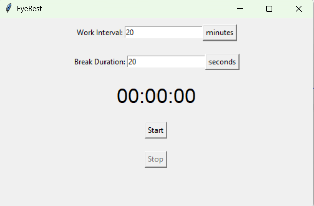

# EyeRest

### Functionality
- This is a simple app built on Tkinter (included in Python) to facilitate regular eye rest while working on computers.
- The current version of the app covers the screen during breaks with overlay; the escape icon exits this notification countdown and starts a new cycle.
- The stop button resets the timer; the timer will begin from 0 until the new (if updated) work interval has elapsed.
### Build EyeRest
This app is currently configured only for Windows.
- First, ensure you have Python installed (this was written with Python 3.12.3; it may run on earlier versions, but that is not guaranteed). Make sure it's added to your PATH during installation (in Windows, you can check this by opening a terminal and entering ```python --version```).
- Open Visual Studio Code and clone this repository (```git clone https://github.com/ianzhou01/EyeRest``` on the terminal). 
- Navigate to the cloned folder in a terminal; run ```python -m venv .venv; .venv/Scripts/activate; pip install -r requirements.txt``` to install dependencies in the environment.
- Run ```pyinstaller EyeRest.spec``` and wait for the process to finish.
- The executable should now be created in the dist directory.
